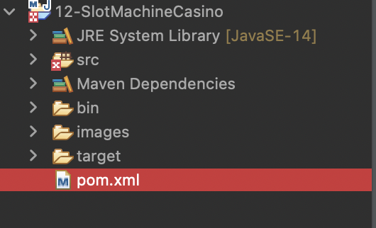
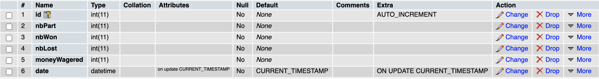
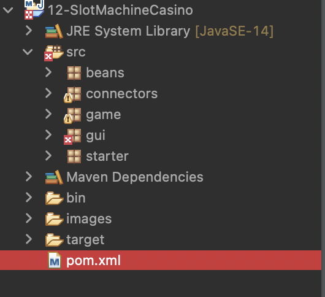
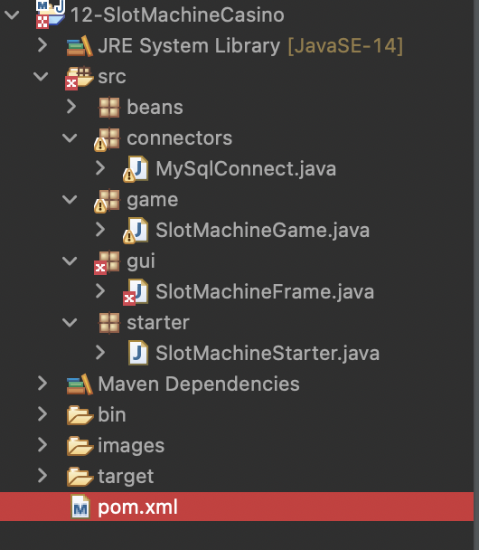

# Projet Java - Slot Machine Game

## Léa Duvigneau & Marie Dugoua


---

---


### Création des dossiers et fichiers utile au jeu :

Tout d'abord créons un nouveau projet "Java" sur l'IDE de votre chois, nous nous utilisons Eclipse.
Nous avons nommé ce projet "SlotMachineGame", une fois ouvert double cliquez sur le dossier du projet afin de le convertir en projet "Maven". Nous allons également danas ce dossier créer un dossier images ou nous placerons les images necessaire a notre jeu, comme ci-dessous :



Nous allons ouvrir le fichier "pom.xml" et y rajouter la dependance necessaire a l'utilisation de base de données.

```xml
 <dependencies>
  	<dependency>
  		<groupId>mysql</groupId>
  		<artifactId>mysql-connector-java</artifactId>
  		<version>8.0.21</version>
  	</dependency>
  </dependencies>
```

Maintenant nous allons sur notre phpMyadmin nous créer la base de donnée souhaiter pour ce projet. Nous l'avons appelé "slotMachine" est avons nommé une table "users" avec les données comme ci-dessous:



Par la suite nous allons créer les "packages" nécessaires dans le dossier sources.



Et les "class".




---

---


### Code nécessaire au fonctionnement du jeu :

Pour La connexion en base de données, nous allons nous rendre dans la "class MySqlConnect" qui ce présentera comme ci-dessous.

```java
package connectors;

public class MySqlConnect {

}
```

 Dans notre "public class" nous allons créer le code nous permettant cette connexion :

**Surtout ne pas oublier les imports de librairi utiles au bon fonctionnement du code.**

```java
package connectors;

import java.sql.Connection;
import java.sql.DriverManager;
import java.sql.ResultSet;
import java.sql.SQLException;
import java.sql.Statement;
import java.util.logging.Logger;

import com.mysql.cj.x.protobuf.MysqlxNotice.Warning.Level;

public class MySqlConnect {
	private Connection m_connexion;
		
	public MySqlConnect(String ip, String base, String login, String password) {
		try {
			String url = "jdbc:mysql://" + ip + "/" + base + "?serverTimezone=UTC";
			m_connexion = DriverManager.getConnection( url, login, password);
		} catch (Exception exc) {
			System.err.println("Constructeur : " + exc.getMessage());
		}	
	}
	
	public MySqlConnect(String base) {
		this("localhost:8889", base , "root" , "root");
	}
	
	public ResultSet select(String sql) {
		ResultSet res = null;
		try {
			Statement instruction = m_connexion.createStatement(ResultSet.TYPE_SCROLL_INSENSITIVE, ResultSet.CONCUR_READ_ONLY);
            res = instruction.executeQuery(sql);
            
		} catch (Exception exc) {
			System.err.println("Probléme sur requête '" + sql + "'");
		}
		return res;
	}
}
```

Par la suite nous allons ouvrir "SlotMachineGame" afin d'y coder l'algorithme du jeu:

```java
package game;

import connectors.MySqlConnect;
import java.time.LocalDate;
import java.time.LocalDateTime;
import java.time.format.DateTimeFormatter;
import java.util.*;

public class SlotMachineGame {
  // Nous déclarons les clefs nécessaires
	public int slot1 = 1;
	public int slot2 = 1;
	public int slot3 = 1;
	public int pieces = 100;
	public int nbParties;
	public int winParties;
	public int lostParties;
	public LocalDate date;

	
	public void newGame() {
		Random randgenerator = new Random();
		
    // Nous récuperons la date du jour.
		LocalDateTime date = LocalDateTime.now();
	    System.out.println("Before formatting: " + date);
	    DateTimeFormatter myFormatObj = DateTimeFormatter.ofPattern("yyyy-MM-dd HH:mm:ss");

	    String formattedDate = date.format(myFormatObj);
	    System.out.println("After formatting: " + formattedDate);

    // On stock des chiffre aléatoires entre 1 et 9 compris.    
		slot1 = randgenerator.nextInt(9) + 1;
		slot2 = randgenerator.nextInt(9) + 1;
		slot3 = randgenerator.nextInt(9) + 1;
	
		System.out.println(slot1 + " " + slot2 + " " + slot3);
		
    // Si chiffre1 est égale à chiffre2 et chiffre2 est égale à chiffre3
		if(slot1 == slot2 && slot2 == slot3) {
			System.out.println("Win 10 pieces");
      // Alors on stock plus 10 piéces
			pieces += 10;
      // plus 1 partie joué
			nbParties += 1;
      // plus 1 partie gagné
			winParties +=1;
      // on stock le nombre de partie perdu si il y a.
			lostParties = nbParties - winParties;
      // Sinon si chiffre1 est égale à chiffre2 ou chiffre1 est égale a chiffre3 ou chiffre2 est égale à chiffre3
		} else if (slot1 == slot2 || slot1 == slot3 || slot2 == slot3) {
			System.out.println("Win 5 pieces");
      // Alors on stock plus 5 piéces
			pieces += 5;
      // plus 1 partie joué
			nbParties += 1;
      // plus 1 partie gagné
			winParties +=1;
      // on stock le nombre de partie perdu si il y a.
			lostParties = nbParties - winParties;
      // Sinon
		} else {
			System.out.println("Loose 2 pieces");
      // On soustrait 2 piéces
			pieces -= 2;
      // on stock plus 1 partie joué
			nbParties += 1;
      // plus une partie perdue.
			lostParties += 1;
		}
		
    // on stock la connexion BDD et on lui passe le nom de notre base en paramétre.
		MySqlConnect connect = new MySqlConnect("slotMachine");

		try {
			// on essaye la connexion en lui injectant les données souhaitées.
			int rs = connect.insert("INSERT INTO users (nbPart, nbWon, nbLost, moneyWagered) VALUE  (" + nbParties + "," + winParties + "," + lostParties + "," + pieces + ")");
			
		} catch (Exception e) {
			System.err.println(e.getMessage());
		}
		
	}
}
```

Ensuite nous allons créer l'interface graphique (frame) du jeu.

```java
package gui;

import game.SlotMachineGame;
import java.awt.BorderLayout;
import java.awt.Dimension;
import java.awt.FlowLayout;
import java.awt.event.ActionEvent;
import java.awt.event.ActionListener;
import java.util.Random;

import javax.swing.ImageIcon;
import javax.swing.JButton;
import javax.swing.JFrame;
import javax.swing.JLabel;
import javax.swing.JPanel;
import javax.swing.UIManager;
import javax.swing.plaf.nimbus.NimbusLookAndFeel;

@SuppressWarnings("serial")
public class SlotMachineFrame extends JFrame implements ActionListener {
		//on déclare les clefs souhaitées
		private SlotMachineGame m_game;
		private JLabel image1, image2, image3;
		private JLabel Parties, PartiesGagnees, NombrePieces;
  
		// constructeur : récupère l'adresse de l'interface et la stock
    public SlotMachineFrame(SlotMachineGame game) {
    	m_game = game;
        this.setDefaultCloseOperation( JFrame.DISPOSE_ON_CLOSE );
        this.setSize(900, 400);
        this.setLocationRelativeTo(null);
        
        JPanel contentPane = (JPanel) this.getContentPane();
        
        contentPane.add(createStatusBar(), BorderLayout.SOUTH);
        
        // On stock les images.
        image1 = new JLabel(new ImageIcon("./Users/marie/eclipse-workspace/12-SlotMachineCasino/images/" + m_game.slot1 +".png"));
        contentPane.add(image1, BorderLayout.WEST);
        image2 = new JLabel(new ImageIcon("./Users/marie/eclipse-workspace/12-SlotMachineCasino/images/" + m_game.slot2 +".png"));
        contentPane.add(image2, BorderLayout.CENTER);
        image3 = new JLabel(new ImageIcon("./Users/marie/eclipse-workspace/12-SlotMachineCasino/images/" + m_game.slot3 + ".png"));
        contentPane.add(image3, BorderLayout.EAST);
        
        JButton btnPlay = new JButton ("Play");
        btnPlay.addActionListener(new ActionListener() {
			
      // Cette fonction permet de mettre l'interfaace a jour au fur est à mesure du jeu
			@Override
			public void actionPerformed(ActionEvent e) {
				m_game.newGame();
				updateImage();
				updateText();
			}
		});
        contentPane.add(btnPlay, BorderLayout.NORTH);
       
    }  
  
  // On retourne les resultat du jeu obtenue.
    private JPanel createStatusBar() {
    	JPanel statusBar = new JPanel(new FlowLayout());
    	
    	Parties = new JLabel();
    	Parties.setText("Nombre de parties :" + m_game.nbParties);
        Parties.setPreferredSize(new Dimension(200, 40));
        statusBar.add(Parties);
        
        PartiesGagnees = new JLabel();
        PartiesGagnees.setText("Parties gagnées :" + m_game.winParties );
        PartiesGagnees.setPreferredSize(new Dimension(200, 40));
        statusBar.add(PartiesGagnees);
        
        NombrePieces = new JLabel();
        NombrePieces.setText("Nombre de pièces :" + m_game.pieces);
        NombrePieces.setPreferredSize(new Dimension(200, 40));
        statusBar.add(NombrePieces);
        
        return statusBar;
        
    }
  
  // On mets a jour les images au fure et à mesur du jeu
    private void updateImage() {
   	 	image1.setIcon(new ImageIcon("./Users/marie/eclipse-workspace/12-SlotMachineCasino/images/" + m_game.slot1 +".png"));
   	 	image2.setIcon(new ImageIcon("./Users/marie/eclipse-workspace/12-SlotMachineCasino/images/" + m_game.slot2 +".png"));
   	 	image3.setIcon(new ImageIcon("./Users/marie/eclipse-workspace/12-SlotMachineCasino/images/" + m_game.slot3 + ".png"));
 
    }
  // On mets a jour les resultats du jeu.
    private void updateText() {
    	Parties.setText("Nombre de parties :" + m_game.nbParties);
    	NombrePieces.setText("Nombre de pièces :" + m_game.pieces);
    	PartiesGagnees.setText("Parties gagnées :" + m_game.winParties );
    }
}
```

Et enfin on lance le jeu.

```java
package starter;

import javax.swing.UIManager;
import javax.swing.plaf.nimbus.NimbusLookAndFeel;

import game.SlotMachineGame;
import gui.SlotMachineFrame;

public class SlotMachineStarter {

    public static void main( String[] args ) throws Exception { 
        UIManager.setLookAndFeel( new NimbusLookAndFeel() );
        // Lance le jeu en rapelant le code de constructiçon de l'interface et l'algorithme du jeu.
        SlotMachineGame smg = new SlotMachineGame();
        SlotMachineFrame smf = new SlotMachineFrame(smg);
        
        smf.setVisible( true );
    }
}
```

